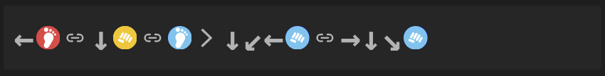
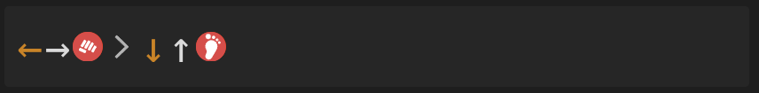

# FG Notation Plugin for Obsidian

Render fighting game combo notation directly in your Obsidian notes. Write inputs in plain text using standard numpad notation and the plugin converts them into visually styled blocks with directional arrows and game-accurate button icons.

---

## Supported Games

| Code block | Game |
|---|---|
| ` ```fg ` or ` ```fg-sf6 ` | Street Fighter 6 |
---

## Usage

Wrap your notation in a fenced code block with the appropriate game tag:

````markdown
```fg-sf6
4.HK , 2.MP , 5.LK > 214.LP , 623.LP
```
````

Each line in the block is rendered as a separate notation sequence.



---

## Notation Syntax

### Directional Inputs (numpad notation)

Directions use standard numpad notation where `5` is neutral:

| Input | Direction |
|---|---|
| `1` | ↙ down-back |
| `2` | ↓ down |
| `3` | ↘ down-forward |
| `4` | ← back |
| `5` | neutral |
| `6` | → forward |
| `7` | ↖ up-back |
| `8` | ↑ up |
| `9` | ↗ up-forward |

Common motion inputs like `236` (QCF), `214` (QCB), `623` (DP), `41236` (HCF), and `63214` (HCB) are all supported.

Use `j` for jump inputs.

### Separators

| Symbol | Meaning |
|---|---|
| `>` | Cancel |
| `~` | Chain |
| `,` | Link |
| `+` | Simultaneous |

### Buttons

Buttons are written with a direction and input, with an optional `.` separator for certain modifiers. For example:

- `5HP` — standing heavy punch
- `236LP` — QCF + light punch
- `j.K` — jump kick
- `c.HS` — close heavy slash

Multi-button inputs like `PP`, `KK`, `PPP`, `KKK` are supported for games that use them.

### Charge Inputs

Use bracket notation for charge inputs:

```
[4]6HP > [2]8HK
```

This means: hold back, release forward + heavy punch.




### Badges

Game-specific modifiers and states can appear inline:

- **Standalone**: `DRC`, `DR`, `DI`, `THROW`, `RC`, `Burst`, `WS`, `WB`
- **Bracketed**: `[CH]`, `[PC]`, `[RISC]`

---

## Game Reference

<details>
<summary><strong>Street Fighter 6</strong></summary>

**Code block**: ` ```fg ` or ` ```fg-sf6 `

**Buttons**: `LP`, `MP`, `HP`, `LK`, `MK`, `HK`, `PP`, `KK`, `PPP`, `KKK`

**Badges**: `DRC` (Drive Rush Cancel), `DR` (Drive Rush), `DI` (Drive Impact), `THROW`

**Modifiers**: `[CH]` (Counter Hit), `[PC]` (Punish Counter)

**Example**:
````markdown
```fg-sf6
236.HP > DRC > 5.MP ~ 5.LP, 2.HK
[4]6.HP > 5.MP > 214.PP
```
````

</details>

---

## Feedback & Issues

Found a bug or want to request a game? Open an issue on the [GitHub repository](#).

---

## Say Thank You

If you are enjoying the plugin, then please support my work by buying me a coffee on [Coming Soon].

Please also help spread the word by sharing about the Obsidian FgNotation plugin on Twitter, Reddit, or any other social media platform you regularly use.